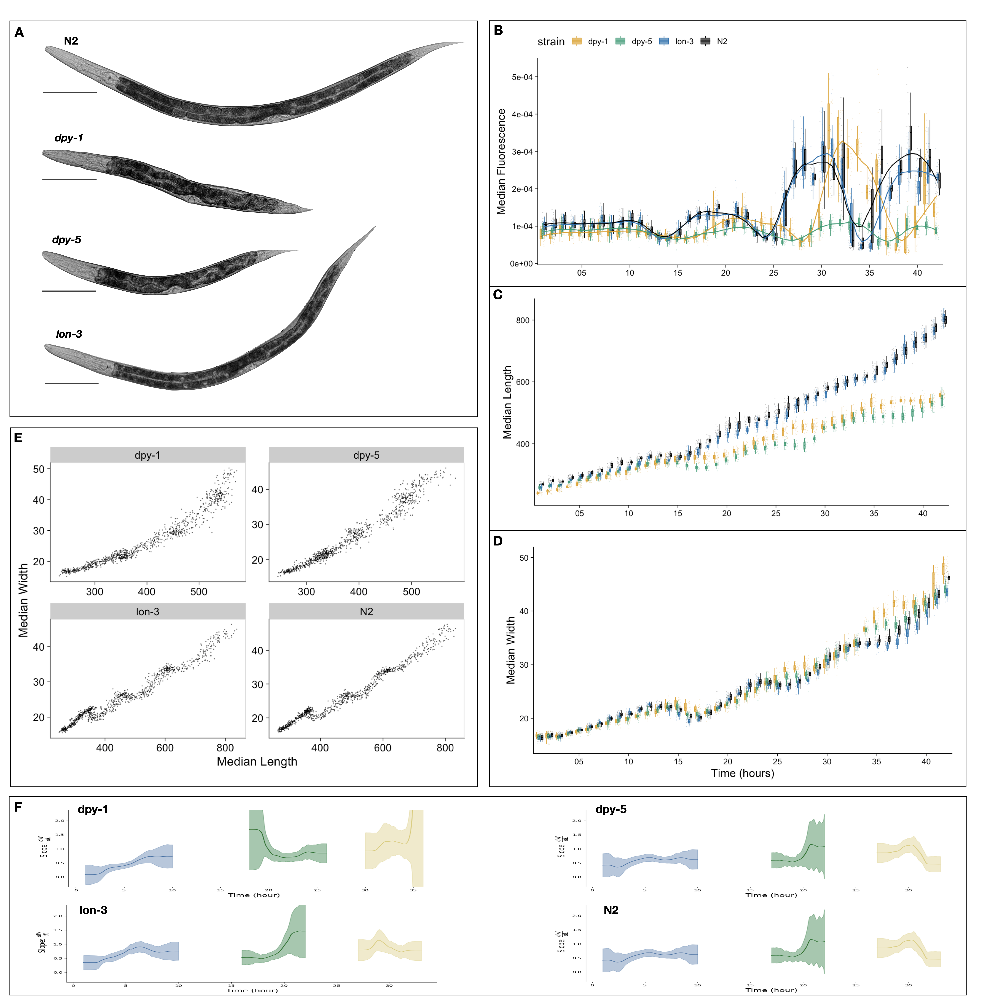

# Appendix

\chaptermark{Appendix}

I had the pleasure of collaborating with members of the Mangan group in the Engineering Science and Applied Math department at Northwestern to investigate *C. elegans* growth using mathematical models. The following are two manuscripts that came out of this collaboration and directly relate to data and thoughts presented in Chapter 2 of this thesis. They are both currently in preparation for submission as microPublications.

# A. Growth dynamics of *C. elegans* cuticle mutants {.unnumbered}

**Characterization of larval growth in *C. elegans* cuticle mutants**

Joy Nyaanga, Sasha Shirman, Niall M. Mangan, and Erik C. Andersen 

## Abstract {.unnumbered}

In *Caenorhabditis elegans*, many genes involved in the formation of the cuticle are also known to influence body size and shape. We assessed post-embryonic growth of both long and short *C. elegans* body size mutants from the L1 to L4 stage. We found similar developmental trajectories of N2 and *lon-3* animals. By contrast, we observed overall decreases in body length and increases in body width of tested *dpy* mutants compared to N2, consistent with the Dpy phenotype. We further show that the dynamics of animal shape in the mutant strains are consistent with a previously proposed "Stretcher" growth model.

```{r echo=FALSE, fig.align='center', out.width='100%'}

```

**Figure A-1: Quantitative assessment of C. elegans larval growth.** (A) Representative images of strains used in this study taken at the L4 stage. Tukey boxplots for median animal fluorescence normalized by area (B), median animal length ($\mu M$) (C), and median animal width ($\mu M$) (D). The horizontal line in the middle of the box is the median, and the box denotes the 25th to 75th quantiles of the data. The vertical line represents the 1.5 interquartile range. Each point corresponds to the median value of a population of animals in each well. (E) Median length (x-axis) plotted against median length (y-axis). (F) The ratio of the change in width to length over time. Calculated from the local slope of data in panel (E). The standard deviation captures population variation (grey).

## Description {.unnumbered}

Body size largely influences an organism's functional characteristics: growth, reproduction, metabolism, lifespan. As a result, the determinant factors of organism size, particularly during development, have been explored in many systems. *Caenorhabditis elegans*, a free-living nematode, presents a versatile genetic model system to study how the processes of growth and development are regulated. *C. elegans* matures to an adult after multiple molting events during which time animals synthesize a new exoskeleton (cuticle) and expel their old one. The *C. elegans* cuticle is a complex, multi-layered structure primarily composed of collagens. As animals progress through their life-cycle, the structure and thickness of the cuticle changes but its role in the maintenance of body morphology and integrity remains. To date, 21 cuticle collagen mutants have been identified that cause a range of body morphology defects (Page and Johnstone 2007). Some of these mutants exhibit a disproportionate reduction in body size, while others are noticeably larger than wild type (Cho et al. 2021), clearly demonstrating the importance of the physical structure of the cuticle on growth. Analyzing the characteristics of size during development in various *C. elegans* body shape mutants is central to understanding the role these genetic pathways have on body growth.

We performed a high-resolution longitudinal study of growth in a selection of *C. elegans* cuticle mutants. We selected mutants that were both reportedly shorter (*dpy-1(e1)*, *dpy-5(e61)*) and longer (*lon-3(e2175)*) than wild type (Cho et al. 2021) (**Figure A-1A**). We then collected high-precision measurements of animal fluorescence (**Figure A-1B**), length (**Figure A-1C**), and width (**Figure A-1D**) from the L1 stage through the L4 stage. As we previously demonstrated (Nyaanga et al. 2022) we can use oscillations in fluorescence as a proxy for feeding behavior to characterize larval progression by associating periods of decreased feeding with molt events. Doing so, we notice that *lon-3(e2175)* animals follow similar developmental trajectories to the N2 wild type. By contrast, we detect a delay in the molt timing of both *dpy* mutant strains, with *dpy-1(e1)* undergoing each larval transition later than all other tested strains. We also observe a marked decrease in animal length and increase in animal width noticeable after the L1 stage in both *dpy* strains, consistent with their characteristic dumpy phenotype. Interestingly, we note little size divergence between *lon-3(e2175)* and N2 animals during our time course.

Measurements of both animal length and width allow us to assess changes in body shape as well as size. Previously, motivated by changes in the body aspect ratio of animals we observed at larval stage transitions, we modeled a physical mechanism by which constraints on cuticle stretch could cause changes in *C. elegans* body shape (Nyaanga et al. 2022). We found that model-predicted shape changes were consistent with those seen in our data of N2 animals. Given this result, we proposed a "Stretcher" model for growth wherein *C. elegans* sense changes in cuticle elasticity, in tandem with other regulatory mechanisms, to control growth rate and determine developmental transitions. Given the structural impacts of *dpy-1(e1)*, *dpy-5(e61)* and *lon-3(e2175)* mutants, we sought to determine whether the shape dynamics predicted by the Stretcher model would be consistent with the mutant data. By analyzing the relationship between measured animal length and width (W/L) over time, we are able to detect the linear and nonlinear stretch regimes predicted by the Stretcher model (**Figure A-1F**). In all strains, we observe an approximately constant W/L ratio in all larval stages, consistent with a linear stretch regime. Next, we observe a shape slope increase, consistent with a nonlinear stretch regime in length preceding larval stage transitions.

## Methods {.unnumbered}

**Worm culture**

The laboratory strain N2 was obtained from the C. elegans Natural Diversity Resource (Cook et al. 2017). All other strains were provided by the CGC, which is funded by NIH Office of Research Infrastructure Programs (P40 OD010440). Animals were cultured at 20C on 6 cm plates of modified nematode growth media (NGMA), which contained 1% agar and 0.7% agarose seeded with *E. coli* OP50 bacteria.

**High-throughput growth assay**

Measurements of body size and fluorescence were measured as previously described (Nyaanga et al. 2022). Briefly, strains were propagated for three generations, bleach-synchronized, and titered at a concentration of 1 embryo per $\mu L$ into 250 mL flasks. The following day, arrested L1s were fed HB101 food at a final concentration of OD20 in a final flask volume of 100 mL K medium and HB101 food. Animals were grown with constant shaking at 20C. Flasks were sampled each hour beginning one hour after feeding and continuing for 42 consecutive hours. At each hour, 800 $\mu L$ was removed from each flask and incubated with fluorescent polychromatic beads (Polysciences, 19507-5) for 10 minutes with shaking. Following the bead incubation, animals were transferred to a 96-well microtiter plate, treated with sodium azide, imaged with an ImageXpress Nano (Molecular Devices, SanJose, CA), and scored using a large-particle flow cytometer (COPAS BIOSORT, Union Biometrica, Holliston MA). COPAS BIOSORT was used to collect measurements of animal length (TOF), optical extinction (EXT), and red fluorescence for every animal in each well.

**Data processing**

COPAS BIOSORT data were processed as previously described (Nyaanga et al. 2022). To remove non-animal objects such as bacterial clumps, shed cuticles, and next generation larval animals from the time-course data. Data for each well was summarized to obtain median well measurements. TOF and norm.EXT data were then converted to microns. Only the unit-corrected data were used for further analysis. "Stretcher" model analysis of shape dynamics was performed as previously described (Nyaanga et al. 2022).

**Reagents**

| **STRAIN** | **GENOTYPE**             | **AVAILABLE FROM** |
|------------|--------------------------|--------------------|
| N2         | *Caenorhabditis elegans* | CeNDR              |
| CB1        | *dpy-1(e1)*              | CGC                |
| CB61       | *dpy-5(e61)*             | CGC                |
| CB4123     | *lon-3(e2175)*           | CGC                |

## Contributions {.unnumbered}

Joy Nyaanga: Conceptualization, Methodology, Investigation, Formal Analysis, Visualization, Writing - original draft

Sasha Shirman: Methodology, Formal Analysis, Visualization

Niall M. Mangan: Methodology, Funding acquisition, Supervision

Erik C. Andersen: Conceptualization, Methodology, Investigation, Funding acquisition, Supervision

## References {.unnumbered}

1.  Page AP, Johnstone IL. The cuticle. WormBook. 2007 Mar 19;1--15. PMCID: PMC4781593

2.  Cho JY, Choi T-W, Kim SH, Ahnn J, Lee S-K. Morphological Characterization of small, dumpy, and long Phenotypes in *Caenorhabditis elegans*. Mol Cells. Korean Society for Molecular and Cellular Biology; 2021 Mar 31;44(3):160--167. PMCID: PMC8019597

3.  Nyaanga J, Goss C, Zhang G, Ahmed HN, Andersen EJ, Miller IR, Rozenich JK, Swarthout IL, Vaughn JA, Mangan NM, Shirman S, Andersen EC. Changes in body shape implicate cuticle stretch in *C. elegans* growth control. bioRxiv. 2022. p. 2021.04.01.438121. Available from: https://www.biorxiv.org/content/10.1101/2021.04.01.438121v3

4.  Cook DE, Zdraljevic S, Roberts JP, Andersen EC. CeNDR, the *Caenorhabditis elegans* natural diversity resource. Nucleic Acids Res [Internet]. 2017 Jan 4;45(D1):D650–D657. Available from: http://dx.doi.org/10.1093/nar/gkw893 PMCID: PMC5210618

# B. Food allocation during *C. elegans* growth {.unnumbered}

**Mechanical control of feeding and allocation of food energy likely constrain growth dynamics in _C. elegans_**

Sasha Shirman, Joy Nyaanga, Erik C. Andersen, and Niall M. Mangan

```{r echo=FALSE, fig.align='center', out.width='90%'}
knitr::include_graphics("img/appendixB/fig1.png")
```

**Figure B-1: Visualization and analysis of food intake and utilization models.** (A) A single cycle in which animals take up and transport food to the gut consists of four general steps. The cycle begins with relaxed pharyngeal muscles and a closed pharyngeal lumen (step 1). The animal opens the pharyngeal lumen so that fluid and food flow through the buccal cavity and into the pharyngeal lumen (step 2). The animal relaxes the muscles that control the opening, stopping the flow of fluid through the buccal cavity and trapping a volume of media approximately equal to the maximum volume of the pharyngeal lumen (step 3). Finally, the pharynx closes, extruding excess media and trapping bacteria and beads that are then 'swallowed' (step 4). (B) Product of pumping frequency and pharyngeal lumen fraction. (C) Dynamics of volume growth rate. (D) Dynamics of the estimated food utilization towards growth. (E) Dynamics of red fluorescence. (F) Dynamics of food allocation breakdown. Food allocated toward maintenance is proportional to animal size (pink). Food allocated toward growth is calculated from food intake (C) and utilization (D) to produce low (dark green) and high (combined green) estimates. Food allocated to other metabolic processes consists of remaining food resources (grey). In panels C-E, the solid blue line represents the mean bootstrap regression. Standard deviation on the regression is marked by the shaded blue region. In panels C-F, Vertical red lines mark molt times. Errors on shaded regions are +/- 0.7 hours. These data are from replicate 2 and are representative of all replicates.

## Description {.unnumbered}

We have previously shown that changes in physical properties of the *C. elegans* cuticle might serve as a cue for developmental timing (Nyaanga et al. 2021). *C. elegans* must have mechanisms to control growth throughout development, particularly in response to these cues. Like most species, *C. elegans* do not increase their growth rate indefinitely in response to increased food availability (Uppaluri and Brangwynne 2015). The animals could control growth entirely using feeding rate, as they actively control the feeding rate (Fang-Yen et al. 2009) and stop feeding at the initiation of a molt (Singh and Sulston 1978). In addition to this mechanical control, they could use metabolic control to preemptively divert ingested resources toward or away from growth. Metabolic processing of stored resources could be especially useful if animals complete their molt and enter a food-limited environment. Using a quantitative feeding model, we examine the *C. elegans* growth data (Nyaanga et al. 2021) to investigate the possible mechanical control of feeding and the metabolic control of the allocation of ingested food toward organismal growth and development.

*C. elegans* is a filter feeder that pumps its food through a cycle of pharyngeal muscle contractions and relaxations that alternatively open and close the pharyngeal cavity. *C. elegans* are capable of actively modulating the length of time used to contract or open a subset of the pharyngeal muscles (Fang-Yen et al. 2009). Our feeding model describes how control of this time length and thus the control of the overall pumping period, defined as the length of time of one full pumping cycle, translates to changes in the rate of food uptake (**Figure B-1A**). The results of our analysis show both an oscillation in pumping rates and a slow change in pharyngeal lumen size throughout development (**Figure B-1B**). The minima of the product of pumping frequency and pharynx fraction occurred during molt times, consistent with prior knowledge (Singh and Sulston 1978; Byerly et al. 1976). The relative length of the pharynx to animal length has been shown to decrease over development (Avery 2003) and a similar trend in the volume of the pharyngeal lumen could explain the slow decrease in the product of pumping frequency and pharynx fraction.

To understand whether animals control growth rate primarily using the mechanical feeding process or metabolic regulation, we describe how food is utilized once it is ingested by *C. elegans*. We assumed three general categories of food utilization: maintenance, observed volumetric growth, and all other processes. We assume that resources required for maintenance are proportional to the volume of the animal. Other processes may include the development of tissues and structures, such as reproductive components, within the worm which are resource intensive, but are not detected during the measurements of the width, length, or volume. Food intake rate (using red fluorescence as a proxy) and volume growth rate (numerically differentiated from the volume regression) follow similar dynamics throughout much of *C. elegans* development (**Figure B-1C** and **Figure B-1E**). Each larval stage consists of three types of dynamics: steady growth during which food intake and growth rate are both increasing (green), preparation for molt during which food intake and growth rate are both decreasing (red), and transition regions where food intake and growth rate do not vary together (white). During steady growth and molt initiation, mechanical food intake rate and allocation of food resources towards observable growth have similar dynamics. At transition points the allocation of food resources towards growth, reaches a local minimum or maximum. These local extrema in food utilization at transition points likely indicate large changes in metabolic regulation (**Figure B-1D**).

Our analysis of the relationship between growth rate and food intake rate quantified the interplay of metabolic regulation and mechanical food intake (**Figure B-1F**). Mechanical food intake provides the upper bound of available food resources for growth, but metabolic regulation substantially changes how much of this available food is utilized for volumetric growth across development. Local extrema in metabolic regulation dynamics coincide with the start of transition times. Within the L2 and L3 stages we observed a decoupling between growth rate and food intake dynamics (**Figure B-1F** white region) twice. The first of these time periods corresponds to the times at which the width-to-length ratio drastically changes and the second corresponds to ecdysis. We estimated that throughout larval stages metabolic resources allocated to non-growth processes varies much less than food resources required for growth and maintenance. The oscillatory behavior of food utilization motivates the need for further metabolomic experiments to probe metabolic regulatory dynamics particularly in around larval-stage transitions.

## Methods {.unnumbered}

**Worm culture**

The canonical laboratory strain N2 was obtained from the *C. elegans* Natural Diversity Resource (Cook et al. 2016) and animals were cultured at 20C on 6 cm plates of modified nematode growth media (NGMA), which contained 1% agar and 0.7% agarose seeded with *E. coli* OP50 bacteria.

**High-throughput growth assay**

Measurements of body size and fluorescence were measured as previously described (Nyaanga et al. 2022). Briefly, strains were propagated for three generations, bleach-synchronized, and titered at a concentration of 1 embryo per $\mu L$ into six replicate 500 mL flasks. The following day, arrested L1s were fed HB101 food at a final concentration of OD20 in a final flask volume of 100 mL K medium and HB101 food. Animals were allowed to grow at 20C with constant shaking. Flasks were sampled each hour beginning one hour after feeding and continuing for 72 consecutive hours. At each hour, 500 $\mu L$ was removed from each flask and incubated with fluorescent polychromatic beads (Polysciences, 19507-5) for 10 minutes with shaking. Following the bead incubation, animals were aliquoted to a 96-well microtiter plate, treated with sodium azide, imaged with an ImageXpress Nano (Molecular Devices, SanJose, CA), and scored using a large-particle flow cytometer (COPAS BIOSORT, Union Biometrica, Holliston MA). COPAS BIOSORT was used to collect measurements of animal length (TOF), optical extinction (EXT), and red fluorescence for every animal in each well.

**Feeding model analysis**

To analyze volumetric growth dynamics and feeding dynamics, volume regression was calculated using a cylindrical approximation for animal shape and the same local kernel regression previously described (Nyaanga et al. 2021) was applied to red fluorescence data. Volume growth rate was calculated using the python numpy gradient function applied to the volume regressions. An additional moving time window average (1.4 hours) was applied to smooth numerical errors in the derivative when determining feeding and growth regime transition points. Model derivations can be found in the Extended Data file.

## Contributions {.unnumbered}

Sasha Shirman: Methodology, Formal Analysis, Visualization

Joy Nyaanga: Investigation, Data curation, Writing - original draft

Erik C. Andersen and Niall M. Mangan: Conceptualization, Funding acquisition, Supervision

## References {.unnumbered}

1.  Nyaanga J, Goss C, Zhang G, Ahmed HN, Andersen EJ, Miller IR, Rozenich JK, Swarthout IL, Vaughn JA, Mangan NM, Shirman S, Andersen EC. Changes in body shape implicate cuticle stretch in *C. elegans* growth control. bioRxiv. 2022. p. 2021.04.01.438121. Available from: https://www.biorxiv.org/content/10.1101/2021.04.01.438121v3

2.  Uppaluri S, Brangwynne CP. A size threshold governs *Caenorhabditis elegans* developmental progression. Proc Biol Sci. 2015 Aug 22;282(1813):20151283. Available from: http://dx.doi.org/10.1098/rspb.2015.1283 PMCID: PMC4632629

3.  Fang-Yen C, Avery L, Samuel ADT. Two size-selective mechanisms specifically trap bacteria-sized food particles in *Caenorhabditis elegans*. Proc Natl Acad Sci U S A. 2009 Nov 24;106(47):20093--20096. Available from: http://dx.doi.org/10.1073/pnas.0904036106 PMCID: PMC2785297

4.  Singh RN, Sulston JE. Some Observations On Moulting in *Caenorhabditis Elegans*. Nematologica. Brill; 1978 Jan 1;24(1):63--71. Available from: https://brill.com/view/journals/nema/24/1/article-p63_7.xml

5.  Byerly L, Cassada RC, Russell RL. The life cycle of the nematode *Caenorhabditis elegans*. I. Wild-type growth and reproduction. Dev Biol. 1976 Jul 1;51(1):23--33. Available from: http://dx.doi.org/10.1016/0012-1606(76)90119-6 PMID: 988845

6.  Avery L. Food transport in the *C. elegans* pharynx. Journal of Experimental Biology. 2003. p. 2441--2457. Available from: http://dx.doi.org/10.1242/jeb.00433

7.  Cook DE, Zdraljevic S, Roberts JP, Andersen EC. CeNDR, the *Caenorhabditis elegans* natural diversity resource. Nucleic Acids Res [Internet]. 2017 Jan 4;45(D1):D650–D657. Available from: http://dx.doi.org/10.1093/nar/gkw893 PMCID: PMC5210618


