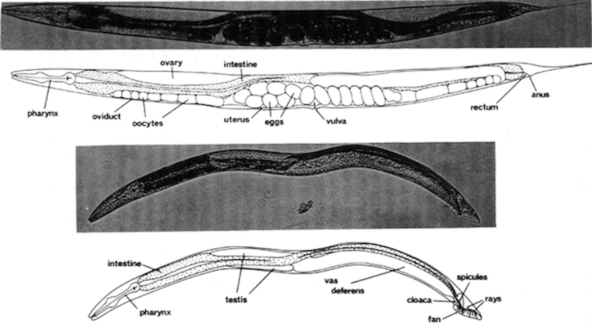
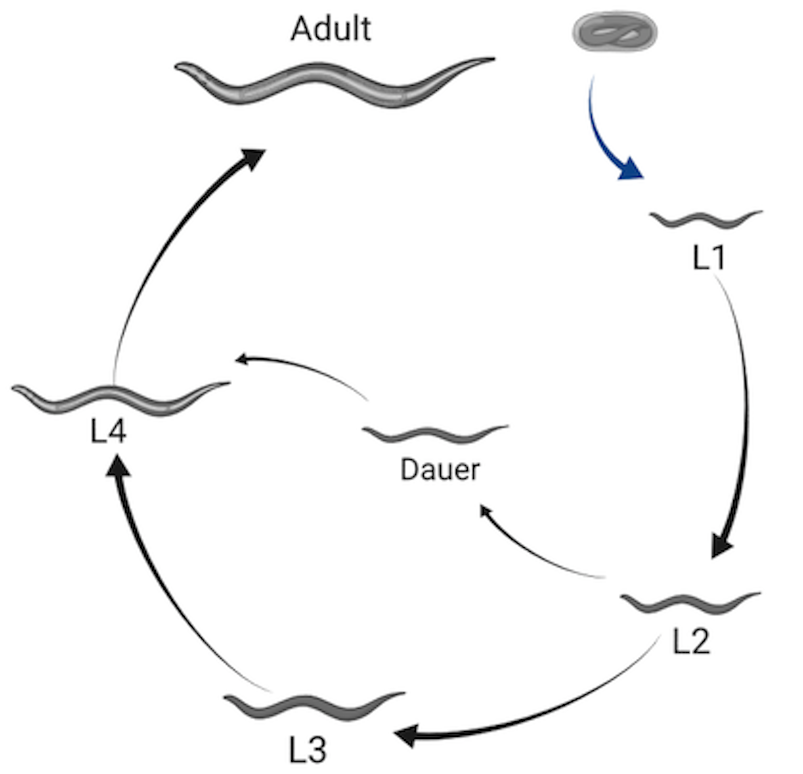
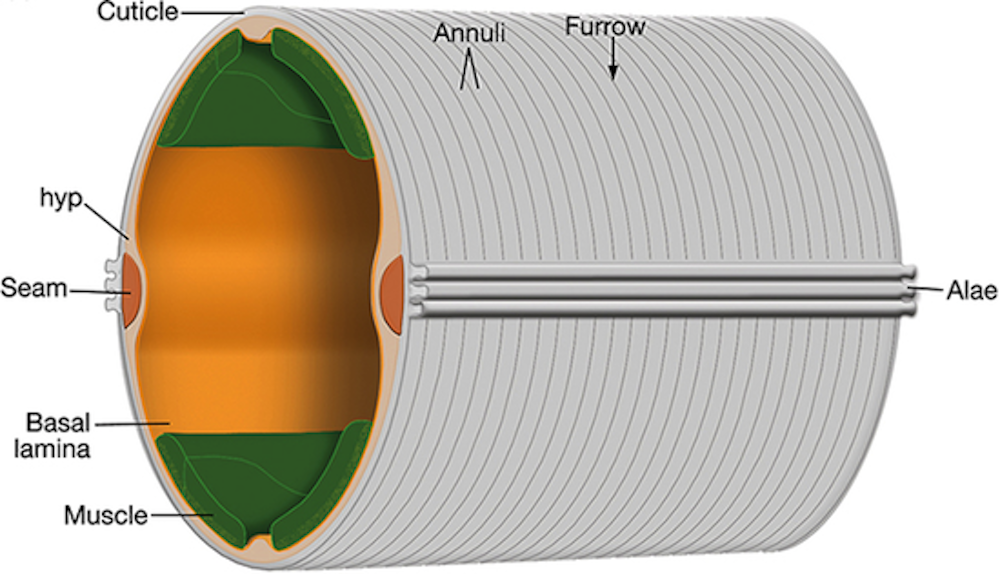
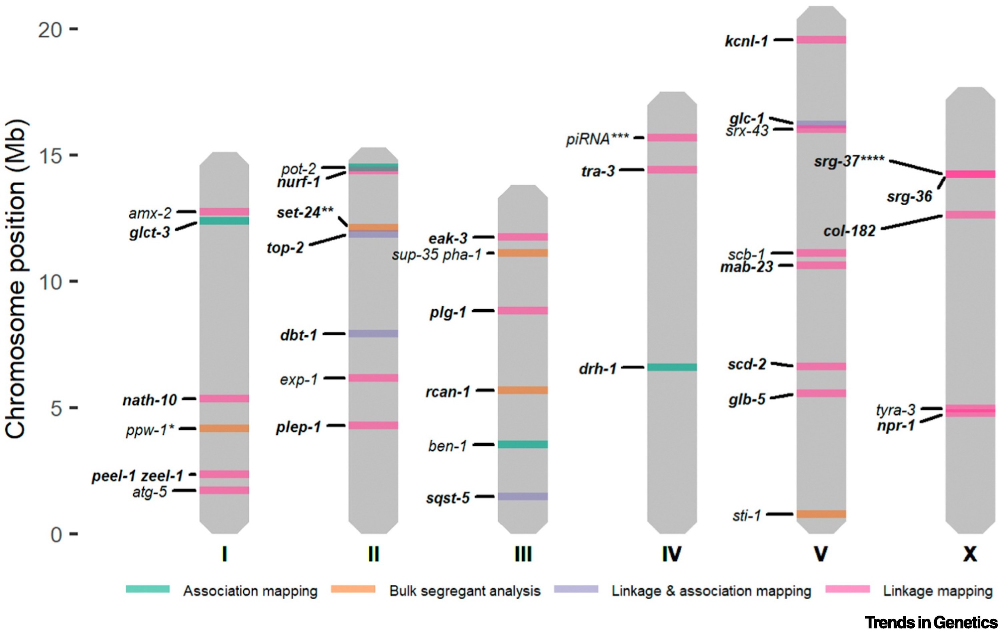

# Introduction

\chaptermark{Introduction}

A fundamental objective in biology is to understand what makes individuals, populations, and species different from one another. The observable characteristics of an organism, such as morphology, physiology, development, and behavior, make up its phenotype. Contrarily, genotype describes the inheritable genetic material that is responsible for determining a given trait @Johannsen1911-yr. The relationship between genotype and phenotype is often complex and multifaceted. Some traits, like color blindness can be linked to single gene mutations @Nathans1986-mn. Most traits, however, are influenced by a combination of genetic and environmental factors. Investigating the variation in complex traits, such as animal growth and body size, provides deeper insights to phenotypic diversity and its causes.

This introduction starts by providing an overview of phenotypic heterogeneity, focusing on the genetic variation that can influence its emergence [Section 1.1](#Section1.1). I discuss how quantitative genetic mapping is used to study underlying variation in complex traits [Section 1.2](#Section1.2). Next, *Caenorhabditis elegans* is presented as an appropriate model system for the study of phenotypic variation [Section 1.3](#Section1.3). I discuss post-embryonic development and examine existing knowledge of how the processes of growth and body size are controlled in the nematode. Finally, I review principles of genetic mapping in *C. elegans*.

## Phenotypic variation {#Section1.1}

The field of quantitative genetics classically postulates that variation among phenotypes arises from two major sources: genetics and environment [@Lynch1998-rh; @Falconer1960-ux]. Expressed as an equation, this can be written as,

$$
V_P = V_G + V_E
$$

where $V_P$ represents variance in a phenotype, $V_{G}$ is genetic variation, and $V_{E}$ is variation in the environment. The genetic component of variation arises from genetic variants within a population @Griffiths2000-jw. Conversely, environmental variation arises when individuals of the same genotype experience changes in environmental conditions (i.e. food availability, temperature) and respond with multiple phenotypic differences @Davis2005-zi. Notably, genetic and environmental components of phenotypic variation are rarely independent; many traits exhibit a genetic component to plasticity. In this case, the observable change in a population's phenotype due to environmental differences is influenced by genetic variation. This form of variation indicates the presence of genotype-by-environment (GxE) interaction. Given this interaction term, total phenotypic variation is more appropriately expressed as,

$$
V_P = V_G + V_E + V_{GxE}
$$

where the contribution of genetic variance to plasticity is captured in the term, $V_{GxE}$ @Gutteling2007-jq.

Another important source of phenotype variation is stochastic variation. For a given environmental condition, random noise exists in the expression of the true phenotype. This uncontrolled variation manifests as differences among individuals of the same genotype raised in a common environment @Felix2015-yc. Accordingly, the total phenotypic variation of a population should now be represented as,

$$
V_P = V_G + V_E + V_{GxE} + V_{Noise}
$$

where $V_{Noise}$ represents intra-individual variation in response to an intrinsic factor. Often, this noise is driven by stochastic fluctuations in the developmental process and called developmental noise [@Kiskowski2019-zd]. The interaction of these various sources of variation ($V_{G}$ , $V_{E}$ , $V_{GxE}$ ,$V_{Noise}$), combined with the sheer magnitude of the number of phenotypic traits, makes the study of the phenotypic variation in a population strikingly complex.

### From genotype to phenotype

In 1865, an Austrian monk by the name of Gregor Mendel published work investigating the connection between genotype and phenotype. For eight years he studied the pea plants that grew in the garden of his monastery, observing patterns in their color, texture, and height from one generation to the next @Mendel1965-ok. Mendel's experiments laid the foundation for our understanding of genetic inheritance and the correlation between underlying genetic makeup and physically visible traits. More than 150 years later, scientists continue to study how genetic variation contributes to phenotypic differences.

Recent advances in sequencing technologies have accelerated the generation of vast amounts of genotype data [@1000_Genomes_Project_Consortium2010-aw; @Telenti2016-ov; @Lek2016-cl] and have also enabled scientists to identify genetic perturbations causally linked to disease traits. However, discerning the relationship between genotype and phenotype remains a challenge. Although there is a strong correlation between the two, phenotype is not solely determined by the genotype of a few trait-associated genes but rather is the cumulative result of interactions among genetic and non-genetic factors over time @Cooper2013-gk. This is particularly apparent in the context of disease. The clinical symptoms we observe in affected individuals are the result of interactions between their genetic background, mutations, and the environment over time. Disease phenotypes may follow Mendelian inheritance patterns and thus be predominantly driven by a single gene mutation, but oftentimes they involve multiple genes along with additional environmental factors [@Antonarakis2006-uh; @Barton2002-um]. As the complexity of a trait increases, it becomes increasingly more difficult to resolve the genotype to phenotype relationship. However, the identification of genetic variants underlying phenotypes is key to understanding how genotype influences complex traits associated with growth, health, and disease.

## Quantitative trait loci mapping {#Section1.2}

Quantitative trait loci (QTL) mapping is a method for identifying the genetic basis of complex traits. With this technique, regions of the genome that contain loci that affect a measurable trait can be identified. Mapping QTL allows scientists to study the underlying genetic architecture of complex traits. Many studies have mapped QTL that affect human disease and have uncovered new loci providing insights into the biology of disease [@Altshuler2008-qh; @Donnelly2008-ma; @Frazer2009-qw].

There are two main approaches to identify QTL: linkage mapping and genome-wide association (GWA) mapping @Mackay2009-wr. Both techniques rely on statistical methods to correlate genetic variation with phenotypic variation. Simply, these methods determine whether the genotype at a given position in the genome explains phenotypic differences among individuals. Linkage mapping uses populations of recombinants generated from a cross between phenotypically and genotypically diverse strains. In contrast, GWA mapping leverages the existing natural genetic diversity among genetically distinct individuals @Mackay2009-wr.

Oftentimes, QTL span large genomic regions containing many genes. To narrow the search space for potential genes contributing to phenotypic differences, the QTL region can be isolated in a clean genetic background with near-isogenic lines (NILs) [@Doroszuk2009-mw; @Wong2002-aa]. The phenotypes of these NILs can then be used to refine the QTL interval by determining whether the introgressed genomic region recapitulates the QTL effect. Ultimately, in organisms with well-annotated genomes, causality can be tested with genome editing tools [@Barrangou2007-zp; @Paix2014-yp; @Doudna2014-dd].

## *Caenorhabditis elegans* {#Section1.3}

French biologist, Emile Maupas, first described isolating *Rhabditis elegans* (now *Caenorhabditis elegans*) near the city of Algiers (Algeria) in 1900 @Maupas1900-ka. He conducted some of the first experiments on the nematode, elaborately detailing its anatomy and development. Several decades later, *C. elegans* was again isolated for study by Victor Nigon and Ellsworth Dougherty. These scientists worked to refine culture conditions and experimental methods for propagating animals in the laboratory @Nigon1943-ps. However, it wasn't until Sydney Brenner published work on the nematode in the 1970s that *C. elegans* became an established model organism @Corsi2015-hh. Since then, research on the roundworm has expanded to explore diverse areas of modern biology and is actively studied in over a thousand laboratories worldwide @noauthor_2016-tp.

### As a model organism

In 1963, well-known bacterial geneticist, Sydney Brenner, decided to turn his research efforts away from bacteria and towards an animal system. He sought an organism that could serve as a genetic model to probe how mutations disrupt eukaryotic processes. After considering a number of organisms, he ultimately settled on *C. elegans* for several reasons @Wood1988-zk. This free-living bacterivore grows rapidly on agar plates or in liquid culture, reaching an adult length of approximately 1.5 mm in three days @Riddle2011-fn. Its small size and transparent body make the nematode an ideal organism for microscopic observation (**Figure 1-1**). As hermaphrodites, *C. elegans* can produce up to 300 genetically identical progeny in a lifetime. These individuals can be maintained nearly indefinitely through cryopreservation, providing a method for long-term storage and safeguarding against the accumulation of mutations [@Brenner1974-kr; @Riddle2011-fn].

**Figure 1-1. Photomicrographs of *C. elegans*.** Major major anatomical features of the *C. elegans* adult hermaphrodite (top) and male (bottom) under bright-field illumination. Bar, 20 $\mu m$. (From @Riddle2011-fn).

Since Brenner's first paper establishing *C. elegans* as a model organism, the animal has become a powerful system for genetic and molecular analysis. Notably, by the 1980s, scientists had documented the entire cell lineage of the nematode, from embryo to adult [@Sulston1977-ie; @Sulston1983-av; @Deppe1978-gy; @Kimble1979-oj]. A decade later, *C. elegans* became the first multicellular organism to have its genome sequenced @C_elegans_Sequencing_Consortium1998-is. This 100 Mb genome, though relatively small, comprises six chromosomes and approximately 20,000 protein-coding genes that are homologous to protein-coding genes found in other organisms, including humans [@Kaletta2006-wg; @Kim2018-xy].

### Post-embryonic development

*C. elegans* post-embryonic development consists of four larval stages (L1 - L4) that are punctuated by distinct developmental events called molts where animals shed an exoskeleton called the cuticle (**Figure 1-2**). Each larval stage begins with a period of active growth, and is followed by a period of quiescence (lethargus) where feeding and movement is temporarily halted @Singh1978-xi. During this time, a new cuticle is synthesized under the old. A molt is completed when animals shed the old cuticle (ecdysis) and transition to the next stage @Monsalve2012-bl.

**Figure 1-2. Illustration of the *C. elegans* life cycle.** Embryos hatch to the first larval stage and proceed through four larval stages (L1 - L4) before becoming mature adults. Transitions between larval stages are marked by molt events where the animal's outer collagen-rich cuticle is shed. An alternate developmental stage, dauer, occurs in response to unfavorable environmental conditions. Created with Biorender.com

The rate of larval development in *C. elegans* is strongly dependent on environmental conditions. Dietary restriction has been shown to extend developmental progression up to ten-fold @Uppaluri2015-wd. In extreme conditions, such as absence of food or high population density, *C. elegans* are able to halt development entirely by entering dauer, a long-lived morphologically distinct stage optimized for survival [@Cassada1975-zx; @Hu2018-qv]. The decision to enter dauer is one of many checkpoints regulating developmental progression. Such checkpoints often occur early in the molting process and have been identified in every larval stage [@Schindler2014-hh; @Baugh2006-nv]. The well-coordinated timing of development is essential to the completion of stage-specific processes including cell-differentiation and tissue morphogenesis [@Monsalve2011-vo; @Zaidel-Bar2010-up], and underscores the importance of growth regulation during *C. elegans* larval development.

### Growth regulation

Organismal growth is regulated on a genetic level, as changes in gene expression patterns and signaling dictate much of development. However, environmental conditions (*e.g.* nutrient availability and temperature) also have strong impacts on growth. Therefore, it is important to account for how the processes of growth and development are controlled genetically, and how they can be influenced environmentally.

#### Genetic pathways regulate body size

The control of *C. elegans* developmental progression has been studied extensively on the genetic level. The very first body size mutants were isolated in genetic screens by Sydney Brenner @Brenner1974-kr. Subsequent screens for small (Sma) and long (Lon) mutants revealed a major regulator of growth and body size: DBL-1 [@Suzuki1999-qm; @Morita1999-fu; @Savage-Dunn2003-sj; @Gumienny2018-oa]. DBL-1 is a ligand in the transforming growth factor-$\beta$ (TGF-$\beta$) superfamily, and homologous to members of the mammalian bone morphogenetic protein (BMP) family @Wu2009-ap. Secreted by neurons and body wall muscle, DBL-1 is necessary for body size regulation, and other developmental and homeostatic processes @Suzuki1999-qm. Mutants deficient in dbl-1 have a marked reduction (40%) in both length and width compared to wild type throughout post-embryonic development [@Suzuki1999-qm; @Morita1999-fu]. In contrast, increased DBL-1 signaling causes animals to be longer (25%) than wild type [@Suzuki1999-qm; @Gumienny2007-qe].

#### Environmental factors modulate body size

As previously mentioned, nutrient restriction is known to decrease *C. elegans* growth rate or, when extreme, induce complete developmental arrest [@Baugh2013-at; @Hu2018-qv; @Uppaluri2015-wd]. Body size is also affected by the quality of food. As bacterivores, *C. elegans* obtain their nutrients primarily from bacteria. Historically, a strain of Escherichia coli, OP50, was chosen as the standard laboratory diet @Brenner1974-wb. While most experimental studies use OP50 as the primary food source, the number of bacterial diets used to propagate *C. elegans* has expanded in recent years. Although these diets support development, research has identified several phenotypic effects that are altered. For example, when fed *Comamonas* DA1877 or *E. coli* HB101, animals develop faster and grow larger than those fed *E. coli* OP50 [@MacNeil2013-pk; @So2011-ls; @Stuhr2020-vr].

Aside from diet, other environmental stimuli can also regulate *C. elegans* body size. Standard wild-type animals used in most experiments grow larger when cultured at lower temperatures @Kammenga2007-cp. Additionally, research has shown that the *C. elegans* nervous system plays a key role in the regulation of body size by environmental stimuli. When raised in isolation, *C. elegans* exhibit decreased growth rates and reach smaller adult sizes compared to animals raised in groups @Rose2005-tz. This result, however, is reversed with mechanosensory stimulation during development, demonstrating a role for mechanosensory neurons in body size regulation. Similarly, a number of mutations affecting ciliated sensory neurons through which *C. elegans* perceive environmental stimuli are shown to be required for animals to grow to the proper size [@Fujiwara1999-zp; @Fujiwara2002-dv]. This suggests that perception of environmental stimuli is crucial for the regulation of body size in *C. elegans*.

#### Cuticle structure influences body size

The *C. elegans* cuticle cuticle is a complex, multi-layered structure primarily composed of collagens. The major surface structures of the cuticle include the circumferential ridges (annuli) and troughs (furrows) @Page2007-im (**Figure 1-3**). As animals progress through their life-cycle, the structure and thickness of the cuticle changes but its role in the maintenance of body morphology and integrity remains. To date, 21 cuticle collagen mutants have been identified that cause a range of body morphology defects @Page2007-im. Several of these mutants (*dpy-2, 3, 7, 8, 10*) lack annuli and exhibit a disproportionate reduction in body size @McMahon2003-vz. These dpy animals are noticeably shorter in length and wider than wild type, clearly demonstrating the importance of the physical structure of the cuticle on growth.

**Figure 1-3. Illustration of the *C. elegans* cuticle.** The hypodermis (hyp) comprises hypodermal cells which secrete the cuticle (grey). Circumferential rings called annuli run the length of the cuticle. The valleys between annuli are furrows, which form immediately above circumferential bundles of actin (not shown) present in hypodermal cells during embryogenesis and molting. Seam cells (orange) that run along the left and right sides. (From @Lints2003-kr).

### Natural genetic variation

*C. elegans* present a scalable and tractable animal model to connect phenotypic differences to genetic variants. *C. elegans* are easily propagated as clonal cultures, eliminating genetic variance as a contributor to phenotypic variance in experimental studies. Additionally, hundreds of wild strains have been collected worldwide, providing access to extensive genetic diversity [@Andersen2012-cy; @Cook2017-zq\]. Two heavily studied strains are the laboratory-adapted strain, N2, and a wild isolate, CB4856. N2, derived from an isolate found in Bristol, UK in 1951, is recognized as the canonical laboratory wild-type strain with its genome serving as the reference @Nicholas2006-fh. Across the globe on the Hawaiian island of Maui, CB4856 was isolated in 1972 @Hodgkin1997-ay. Compared against the N2 reference, the CB4856 genome is highly divergent [@Thompson2015-fp; @Kim2019-ck]. This extensive genetic diversity likely underlies the many phenotypic differences between the two strains, including social behavior, life-history traits (body size, fecundity, lifespan), and gene expression [@Capra2008-io; @Rockman2010-ne; @Vinuela2012-lr; @De_Bono1998-ea; @Gutteling2007-jq; @Andersen2014-zv].

### Linkage mapping

The N2 and CB4856 strains can be studied to better understand how genetic variation contributes to phenotypic differences. Crossing the N2 and CB4856 strains for many generations produces individuals with unique variants derived from each parental background. Performed at a large scale, these panels of recombinant inbred lines are a powerful tool for identifying genomic regions that are correlated with phenotypic variation.

Linkage mapping is a popular genetic mapping approach used to identify functional variants that contribute to phenotypic diversity. In *C. elegans*, linkage mapping leverages recombinant line panels, correlating genotype and phenotype to identify QTL. The Andersen Lab has developed an R package to facilitate such analyses @Shimko2014-eb. By investigating the natural genetic variation underlying phenotypic differences, researchers are able to uncover genetic pathways involved in biological processes. Several studies have taken this approach to study the genetic underpinnings of complex traits like body size, social behavior, and drug response (**Figure 1-4**) [@Andersen2014-zv; @Bendesky2011-qp; @Brady2019-qg; @Evans2020-db; @Hahnel2018-da; @Zdraljevic2019-fr; @Zdraljevic2017-jd].

**Figure 1-4. Overview of causal genes identified through QTL mapping approaches.** The colors represent the mapping technique(s) that were used for QTL mapping: bulk-segregant analysis (BSA) (orange); linkage mapping (pink); genome-wide association (GWA) mapping (green); linkage and GWA mapping (purple). (From @Evans2021-zr)
