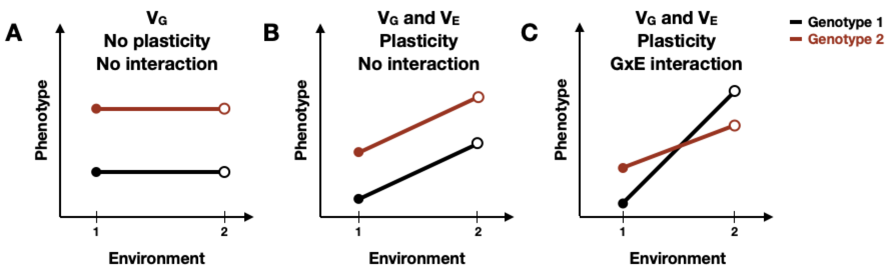

# Discussion

\chaptermark{Discussion}

Extensive phenotypic diversity exists in the animal kingdom. A goal of biological research is to decipher the source of this diversity and study its impact on individuals, populations, and species. Body size, in particular, is a trait that varies strikingly across animal phylogeny, and has critical ramifications on an animal's ability to survive and reproduce. For this reason, scientists aim to understand how organisms grow to their characteristic sizes. Organismal development comprises a sequence of genetically programmed and intricately linked events that follow precise temporal and spatial ordering. Remarkably, despite variation in environmental conditions (e.g. temperature, nutrient availability, etc), developing systems coordinate the organization and interaction among cells, tissues, and organs with high reproducibility. My graduate work focused on investigating mechanisms of growth regulation in developing *Caenorhabditis elegans*. Here, I will elaborate on the implications of my data and provide insights that will hopefully propel future research.

## Summary 

This dissertation aimed to present mechanisms by which developmental growth may be controlled using the roundworm nematode *Caenorhabditis elegans*. Studying *C. elegans* larval development is relatively straightforward, however, doing so at high temporal resolution while maintaining high precision and throughput can be a challenge. In **Chapter 2**, I introduce a high-throughput phenotyping platform I optimized to facilitate the quantitative assessment of size and feeding behavior of thousands of individuals under tightly controlled environment conditions. Using this platform to collect growth data over time, I find that as animals transitioned from one developmental stage to the next, changes in body shape occurred. Given this result, I worked with mathematical scientists to model a physical mechanism by which constraints on cuticle elasticity could cause changes in *C. elegans* body shape, and found the model-predicted shape changes to be consistent with those observed in the experimental data. This work puts forth a novel "Stretcher" mechanism for how *C. elegans* could use physical constraints (i.e. restriction of cuticle stretch) as a sensor for growth and as a means to regulate developmental timing. Noting the importance of the cuticle in *C. elegans* growth, I further examine the larval development of three strains with mutations in distinct cuticle collagen proteins in **Appendix A**. Two of the three mutant strains exhibit delayed growth and maintain a consistently shorter and wider shape when compared to wild type, emphasizing the importance of cuticle structure in development. Importantly, all three strains exhibited dynamics consistent with a "Stretcher" growth model.

The process of development is highly reproducible even in the presence of genetic and environmental perturbations. In **Chapter 3**, I leverage *C. elegans* natural genetic diversity to explore how genetic variation contributes to differences in animal growth. Using a quantitative genetic mapping approach, I identify distinct genomic regions that separately explain variation in animal length and width. This work highlights the complex genetic architecture of body size, identifies promising candidate genes that may underlie variation in animal width, and provides a framework for future studies to investigate genetic mechanisms controlling developmental growth and body size in natural populations of *C. elegans*.

Like many high-throughput imaging techniques, the experimental platform introduced in Chapter 2 generates large quantities of data that can be difficult to process and visualize efficiently. In **Chapter 4**, I discuss the development of easyXpress: an R package that provides tools for the reading, processing, and visualization of *C. elegans* microscopy data in a simple and efficient way. This software package enables reproducible analysis, integration with other statistical R packages, and extensibility to many research projects using an open-source analysis pipeline.	

## The future of developmental growth studies

### The *C. elegans* cuticle and its role in developmental timing

Molting is a unique characteristic that defines the life cycles of many animal species including, arthropods (insects, arachnids, crustaceans), nematodes (roundworms), and other members of the Ecdysozoa group [@Aguinaldo1997-ig; @Telford2008-ya]. Despite its prevalence, the primary function of molting varies across these different groups. Arthropods, covered by rigid chitin-based cuticles, require molting for body size expansion [@Alpatov1929-li; @Rice1968-em]. By contrast, the nematode body is encased in a flexible collagen-based cuticle that allows for growth and expansion between molts [@Howells1983-vf; @Wilson1976-bc], leaving the question: _Does the *C. elegans* cuticle play a role in developmental growth and molting?_

Few longitudinal studies of *C. elegans* growth have been performed. Initial research described *C. elegans* development as a sigmoidal curve characterized by continuous larval growth [@Byerly1976-xt; @Malakhov1986-nb]. These early studies reasoned that molt events had little effect on continuous growth as the *C. elegans* flexible cuticle allowed for stretch during development. Later work clarified that growth rate was not continuous but rather piecewise in nature and increased from stage to stage, suggesting that *C. elegans* may contain a mechanism for regulating growth rate, potentially through each molt event @Knight2002-fb. Next, researchers found that animals only advance to the next developmental stage once a critical size is reached, implying that each molt decision is controlled by a size threshold @Uppaluri2016-gm. Recent work shows that *C. elegans* development is likely controlled not by size-dependent regulation of growth but rather by relative change, or fold change, in body volume, suggesting that animals trigger molting events in ways that maintain a constant fold change in body volume @Towbin2021-vx. However, two questions remain: *How do animals sense their body size?* And most importantly, *how is this information disseminated to precisely regulate growth?*

In Chapter 2, I have proposed a novel mechanism by which physical constraints can influence developmental timing and growth rate in *C. elegans*. Although elasticity of the cuticle permits growth during each larval stage, cuticle "stretchiness" is limited. By sensing the reduction of cuticle elasticity, *C. elegans* could use this as a mechanical signal to trigger molting events. To validate this proposed mechanism, one must first determine whether cuticle elasticity changes during a larval stage. Previous atomic force microscopy (AFM) studies of *C. elegans* suggest that animals experience a loss of stiffness as they age @Essmann2020-cb, however no studies have been performed on the developing nematode.  Capturing AFM images of the cuticle over the course of a single larval stage would be a potential method to investigate cuticle stiffness during growth. AFM experiments, however, are limited in that they apply small highly localized indentation forces that may not adequately represent the large stretching loads experienced during growth. To confirm elasticity changes in the cuticle, direct measurements of the stiffness of isolated cuticles is essential. Recently published work using microfluidic technology to stretch isolated cuticles found significant increases in longitudinal stiffness at large stretching loads @Rahimi2022-ur. Performing similar tests to isolated cuticles of animals preceding and following a molt could provide support for our hypothesis that molting occurs as a result of decreased cuticle elasticity. Additionally, if we find that cuticle elasticity changes during development, it could be interesting to collect growth measurements of animals cultured under varying osmotic conditions. Given our stretch-based growth model, I would expect to observe accelerated developmental timing in animals exposed to hypoosmotic conditions because of the relatively high stretching loads on the cuticle throughout growth.

Identifying changes in cuticle elasticity during growth is just one part of understanding the role the cuticle may play in molt timing. We must also consider how information originating from the cuticle is sensed and propagated to the rest of the animal. In *C. elegans*, attachment complexes called hemidesmosomes connect the cuticle to the epidermis and are shown to respond to mechanical tension exerted by muscle contraction @Zhang2011-ea. It is possible that *C. elegans* hemidesmosomes act not only as an attachment structure but also as a mechanosensor that responds to forces at the epidermis and at the cuticle. Additionally, motor neurons may serve as another potential mechanosensor. Mechanosensory neurons are typically used to regulate various behaviors including, locomotion, egg laying, pharyngeal pumping, and defecation @Riddle1997-jv. Notably, many motor neurons extend along the longitudinal body axis and some also extend circumferential axons @Altun2005-jf, opening up the possibility that these neurons might provide signals proportional to body length and width. Future studies of how perturbations of hemidesmosomes and motor neurons influence *C. elegans* body size and developmental timing would be worthwhile. 

### Identifying genetic factors that contribute to variation in growth and body size

Discerning how complex traits are genetically controlled is essential to understanding the evolution of phenotypic diversity. Genetic regulators of trait variation can be mapped using QTL analysis of RIAILs derived from genetically and phenotypically divergent strains. In my work, I used linkage mapping to identify genetic loci underlying differences in *C. elegans* body size, and found three small-effect QTL explaining 5-8% of variation in the RIAIL phenotypes. Our ability to detect and validate one of these QTL emphasizes the power of using *C. elegans* to correlate small-effect genetic loci to quantitative phenotypes. In Chapter 3, I postulate that the inability to recapitulate the other two QTL effects could be attributed to insufficient power or the presence of additional undetected QTL with additive or non-additive effects. The CSSs and NILs I used for validation experiments each contained a single region of introgression in a genetic background of the opposite genotype. Future work should aim to construct double CSSs or multi-region NILs where pairwise combinations of two genomic regions are introgressed in the opposite genotype. Phenotyping these additional strains could reveal additional loci contributing to the chromosome IV and V effects.

#### Alternatives to classical linkage mapping

***Genome-wide association (GWA) mapping***

High levels of genotypic and phenotypic diversity exist in natural populations. In contrast to linkage mapping where genetic diversity is limited to the two parental strains, GWA mapping leverages the existing natural diversity found in a population. By correlating phenotypic variation among wild strains with whole-genome data, GWA studies identify functional variants that contribute to phenotypic diversity. In *C. elegans*, a growing collection of wild strains and genome-wide variation data are readily available (CeNDR, @Cook2017-zq ). Using this resource, association mapping has led to the discovery of genes and variants that underlie variation in complex traits (**Figure 1-4**) @Evans2021-zr.

Recently, the Andersen Lab completed an extensive GWA experiment, collecting body length measurements for 195 wild strains across 54 different drug conditions. Exploring this data to identify size-associated QTL of animals exposed to the control condition (water), and comparing the results to the linkage mapping presented in Chapter 3, would be the next step for subsequent investigations of genetic factors that underlie differences in *C. elegans* growth and body size. With data from the linkage and association mappings, we could look for QTL that overlap between the two methods. Overlapping QTL would suggest that a common variant present in the CB4856 strain contributes to differences in body size of animals in both mapping populations. Alternatively, non-overlapping QTL would suggest that the QTL identified from linkage mapping is driven by a rare variant in the CB4856 strain, whereas the QTL identified from association mapping is driven by a common variant not found in the CB4856 strain. The combination of both association and linkage mapping provides an approach to both narrow genomic intervals and generate refined lists of potential causal genes.

***Bulk-segregant analysis***

QTL mapping has been central to the identification of loci underlying complex traits in *C. elegans*. However, QTL mapping typically requires the generation of large panels of cross progeny that must be individually genotyped and phenotyped, a lengthy and often costly task. An alternative to traditional QTL mapping is bulk-segregant analysis (BSA). In contrast to constructing, sequencing, and phenotyping individuals for a RIL/RIAIL panel, the BSA approach uses pools of recombinant individuals generated from genetically and phenotypically divergent parents. Recombinant individuals are then selected based on the phenotype of interest and allele frequencies are compared between the unselected and selected pools. Over recent years, researchers have demonstrated the power of using BSA to connect phenotypic differences to specific genes (**Figure 1-4**) @Evans2021-zr. Leveraging BSA to identify QTL associated with developmental growth would be a worthwhile endeavor. Recombinant individuals from an N2xCB4856 cross could be cultured as described in Chapter 2. Then by selecting the tails of the population distribution, the allele frequency changes of the "large-sized" and "small-sized" individuals during the experiment can be compared. Repeating this over various stages during development could potentially reveal unique QTL for independent larval stages. Alternatively, one could make use of population-wide diversity by performing growth and selection on a pool of wild isolates. The application of a powerful mapping method like BSA to identify QTL will expand our understanding of the molecular mechanisms underlying *C. elegans* growth and development.

### Phenotypic plasticity and genotype-by-environment interaction

In my graduate work I study the growth and development of *C. elegans* under tightly controlled environmental conditions. However, environmental factors in natural habitats are rarely constant, and this variation can impact developmental progression and growth rate. Research has shown that rearing temperature, as well as both food quality and quantity alter the speed of *C. elegans* larval development [@MacNeil2013-pk; @Stuhr2020-vr; @Altun2006-zw]. The term phenotypic plasticity is used to describe this phenomenon where an individual can generate multiple phenotypes based on external conditions @Pigliucci2006-gf. Notably, distinct genotypes of a single species can show unique patterns of plasticity. Genotype-by-environment (GxE) interactions represent this contribution of genetic variation to environmental sensitivity.

Reaction norms are often used to visually compare plasticity among different genotypes by displaying phenotype differences as a function of environmental change @Lafuente2019-up. A phenotype may be constant across genotypes and environments, or it may be affected in several ways. First, phenotype could differ between genotypes, indicating genetic variation, but remain unaffected across multiple environments. Displayed as horizontal lines between environmental parameters, this case represents robustness to environmental perturbation (**Figure 5-1A**). Second, regardless of genotype, there could be a general plastic response to environmental change. Here, diagonal lines between environmental conditions reflect plasticity and the slope of the line represents the magnitude of plasticity (**Figure 5-1B**). Third, the magnitude of plasticity for a given trait could vary among genotypes, represented as non-parallel reaction norms (**Figure 5-1C**), indicating the presence of GxE interaction. Although the occurrence of GxE interactions is well studied, the genomic regions involved are not because of the complex interaction between genetics and environmental factors that drives plasticity [@Pigliucci2005-te; @Hodgins-Davis2012-ok; @Rocha2009-zc].

**Figure 5-1.** Schematic representation of reaction norms, illustrating various forms of plasticity.
  
In the last month, research was published that explored the genetic architecture of body-size plasticity in *C. elegans* @Maulana2022-jy. Researchers used 40 RILs derived from the N2 and CB4856 strains to investigate the effects of temperature and developmental stage on the reaction norms of various body-size traits (animal length, width, and size of some internal organs). Not only did they find clear evidence of GxE interactions, but they also noticed that the shape of the reaction norm was affected by developmental stage, potentially stemming from differences in interaction between stage-specific gene expression patterns and environmental temperature. Authors also performed QTL mapping and found 18 loci underlying body-size traits and only five plasticity loci. Interestingly, three plasticity QTL colocalized with body-size QTL, suggesting the possibility of co-regulatory loci influencing both plasticity and the traits themselves. Future work should build on these findings by collecting size measurements for wild *C. elegans* strains under different environmental conditions. This research is vital to our understanding of the complex interplay between genetic mechanisms and environmental forces that shape phenotypic variation in natural populations.
